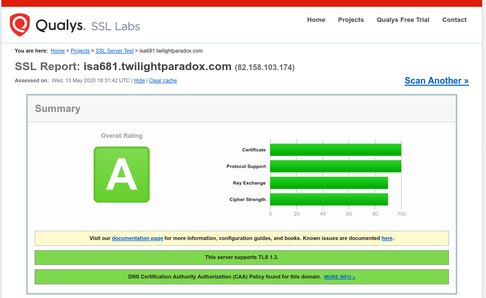
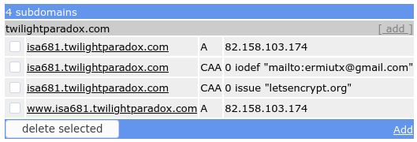
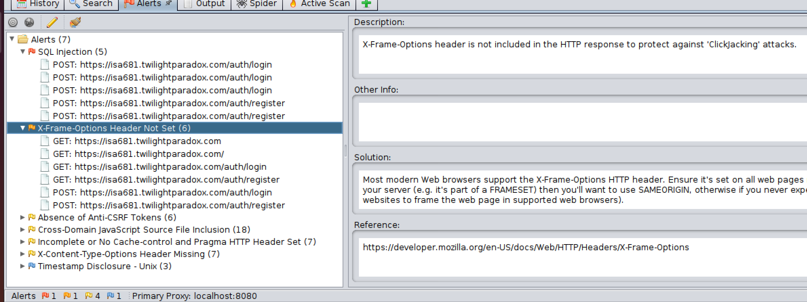
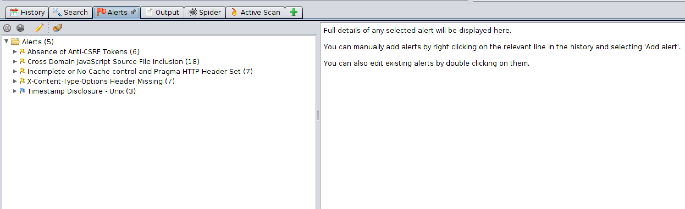

# Mus Online
*Guillermo García Grao and Sergio Yerbes Martínez*

*ISA681*, *May 13th 2020*

***

## 1. Introduction

Our project is an online implementation of the Mus game, a very popular cards game in Spain. It is written in Python using th Flask framework. It is hosted at <isa681.twilightparadox.com>. The goal of this project is to present web-based game with multiple players that is secure.

***

## 2. Design/Arhitecture

### 2.1 Structure

The project is structured as follows:

+ The project is divided in 3 different blueprints (modules), the auth blueprint for authentication, the play blueprint for the game itself, and the info blueprint for the history and statistics. The main functionality of this blueprints can be found in the auth.py, play.py and info.py files respectively.

+ In the mus.py file, all of the objects used during the game can be found. The models.py file contains the declarations of the database table and the forms.py the declaration of the user forms.

+ The templates and static directories store every HTML template and static file.

+ In the root directory, there are three bash scripts: startup, run and analyze. The startup script creates a virtual environment fot python and install all the required packages. The run script launches the application at localhost:8000. The analyze script runs the Bandit tool on the code and generates a bandit-report.txt file. The config.py file is also here, as well as the main.py file used to run the application.

### 2.2 Main functions and classes

In the auth.py file there are two important functions: `register()` and `login()`. These are responsible for rendering the registration and login forms and validating the user inputs.

Most of the game logic is in the play.py file. Here, the functions with the `@socketio.on` decorator are the ones that receive events from the clients. There are four of those: `new_connection()`, `new_disconnection()`, `client_mus_turn(data)` and `client_game_turn`. The rest of the functions thet are not for routing are to handle different stages of the game.

The main classes for the game are defined in the mus.py file. The Room object is used to handle everything related to a game. The Player object creates a relationship between a user, a socket connection and a hand of cards. There are also a Round object and a Phase object from which others inherite. Each Phase child object (Grande, Chica, Pares and Juego) has its own method for computing the winner and points of that particular phase. Finally, the Deck and Mus objects handle the first phase in each round of the game, when the cards are dealt and players can discard if they choose to.

***

## 3. Installation Instructions

The code works in both Ubuntu and MacOS. The python3 python3-dev python3-pip python3-venv dependencies have to be installed. After extracting the .zip file, execute the startup script. It will install every package that the application needs in the venv folder (virtual environment). After it's finished, execute the run script. The server should be up and running, and can be reached at localhost:8000.

***

## 4. Operating Instructions

Once the web browser is on the home page, there is a ‘Welcome’ message with a login hyperlink for registered users. If it’s the first time to access the website, the first step should be to register, clicking on the ‘Register’ button from the top navigation bar. After the clicking, a new webpage comes up. It has a form for registration. At this point, when the registration process is completed, we are being redirected again to the login URL.

Once the login process is done, we are at the main menu of the game. There are several options: logout, create a new game or join an existing game. The navigation bar has also changed, allowing the user to check the history (which is empty if no games have been played yet), a statistics section, and the logout option. But coming back to the game itself, the following normal step is the creation of a new game. For this purpose, we just click ´Create a new game´. A new screen is presented, with the basic items for the gaming start, but waiting for the proper number of players to be connected to this particular game session.

From now on, the first player is waiting for another 3 players to connect. This could be done by executing multiple instances of a private browser tab, and registering and login with all the new users, besides joining the existing game.

When the game session has started, the phase indicated in the top part of the screen is ‘Mus’. In this game phase, all players are able to discard the cards that are not useful for them, by clicking into the card, which will be turned around, and later click into the ‘Mus’ button. The amount of cards selected before the ´mus´ is demanded is on player’s election. But, if there is a single player who doesn’t want to discard any card, and if the ‘No Mus’ button is pressed by that player, the ‘mus’ round is over and nobody is able to discard any card. If there are cards with the reverse prepared to be discarded in other player’s screen, they can be reverted by their original value by just clicking on it.

Therefore, when a ‘No Mus’ button is clicked, the game moves on to the next phase: the ‘Grande’. At this point, none of the players is able to discard until the next round, so the buttons ‘Mus’ and ‘No Mus’ are hidden. In the ‘Grande’ round, players have to bet depending on their cards, but an order has to be followed. Specifically, the order starts by the ‘mano’ player. The buttons are hidden for the players which doesn’t have the turn assigned, and unhidden for the current player.

There are three available buttons: ‘pass’, ‘accept bid’ and ‘envido’.
A player who is not interested in betting, has the option to ‘pass’, giving the turn to the next player. If the chosen option is betting, there are two available options:

+ ‘Envido’ button:  this option is suggested for players who want to opt for the standard bet in ‘Mus’, two points. Once the ‘Envido’ button is clicked, the turn is then passed to the next player, with a 2 points bid for the team corresponding to that player.

+ Betting Input form: there is an option for player interested in betting a higher amount of points. The number can be typed in the input field. A game is won when the score goes up to 40 points, so it is useless to bet further than that.

This process is repeated throughout the players, until all players from same team have clicked ‘pass’, so the bet from the other team is not accepted, or just every player has clicked it. Furthermore, when a bet from a team is accepted by the other team, but not increased, it is considered that the current phase is finished.

The ‘Chica’ phase is exactly the same has the ‘Grande’ phase. The game operation follows the same flow but considering different strategies by the player according to their cards.

The next phase is ‘pares’. This phase has slight differences with the previous ones. The server is going to calculate first which have players have ‘pares’. Depending on the result obtained, some variants can happen:

+ Nobody has ‘pares’: the phase is automatically terminated, so the game is moved on to the last phase.

+ One player has ‘pares’: the phase is also terminated, and the game is moved on to the next phase. Nevertheless, the player who has ‘pares’ is winning the base points for having ‘pares’.

+ More than one player has ‘pares’: the phase is played following the same workflow than ‘grande’ and ‘chica’ at this point, with each player being able to bet or pass, respecting their assigned turn. It’s important to highlight that not every player may have ‘pares’, so the turn assignment will probably vary.

The last phase is ‘juego’. As well as in ‘pares’, the server has to first calculate if players have ‘juego’ or not. We can distinguish three different cases:

+ Nobody has ‘juego’: phase terminated. Nobody is getting the points.

+ One player has ‘juego’: the player in possession of ‘juego’ is automatically getting the points for it.

+ More than one player has ‘juego’: the phase is played in a standard way, in the same manner as any other round, but considering that not everybody may have ‘juego’, so the turn is assigned depending on this.

The game round has now finished, moving on to the ‘show down’ phase. The cards of the different players are publicly revealed, and the server is informing the players who won each bet and adding that score to the global team score. This information is shown in the ‘messages’ section. If the score is under 40 points for both teams, the game isn’t finished yet, so the players have to wait 60 seconds for the next round start. Next rounds are played in the same manner.

There are some caveats that should be considered:

+ A player disconnected for more than 1 minute is automatically losing the game for the team which is belonging to. An alert message is shown in the screen informing about the winners and the losers.

+ If a player is disconnected, the reconnection is still possible (considering that minute of margin). If the reload page button is clicked, the game works without problems.

+ A player cannot play on two games at the same time, but several games can be played at the same time if their players are different.

***

## 5. Game Rules

‘Mus’ is a very popular game in Spain, with many similarities with poker. It is a card based game with betting, with the particularity that it’s played in pairs, as a team. Usually, partners are seated in opposite seats.

The set of cards is the standard 40 card Spanish deck, which doesn’t have the seven, eight or nine numbers. Therefore, the cards are: Ace, two, three, four, five, six, seven, ‘Sota’, ‘Caballo’ and ‘Rey’. Ace and two are equivalent cards, whereas ‘Rey’ and three are also equivalent.

The game is won when a pair reaches the 40 points barrier, which usually takes several rounds. The overall winner is the pair to get to two games won, because It’s usually played for the best of three.

There is a player who is chosen as ‘mano’, who is having the privilege of talking first on each round.

There are different phases into a game round. The first phase is called ‘Mus’, the second ‘Grande’, the third phase ‘Chica’, the fourth phase ‘Pares’ and the final phase ‘Juego’ which can be substituted by ‘Punto’ if the cards are not playable for ‘Juego’.

+ Mus: this is the first round where players are reviewing the four cards randomly dealt. Starting with the ‘mano’, each player decides if one or more cards are discarded, respecting their turn. If any of those players cut ‘Mus’, none can discard any card, and the next phase begins.

+ Grande: once the card dealing phase is over, the ‘mano’ player is in charge of proposing a bet for ‘Grande’, if there is not an interest on it, the turn can be passed to the next player. In the ‘Mus’ game, a very popular bet is the ‘envite’. This bet is a total of two points. Another pupular bet is the ‘ordago’, in which the player proposing it, is betting the entire game result. If the other player accepts it, the winner is automatically decided in this turn.

  In ‘Grande’, the cards with the most value are the ‘Rey’ or three (which are equivalent, as stated before), whereas the ace or two (also equivalent) are the least important. Therefore, the winner of the round is the layer with more ‘Rey’ or three cards. If there is a draw, the next most valuable card is setting the winner. In order, the most valuable cards after the ‘Rey’ or three are: ‘Caballo’, ‘Sota’, seven, six, five, four and two or ace.

+ Chica: the ‘Chica’ game procedure is equivalent to Grande, but the order of the most valuable cards is totally different. Now, the best card is the Ace or two, and the order is the inverse of ‘Grande’: Ace or two, four, five, six, seven, ‘Sota’, ‘Caballo’ and ‘Rey.

+ Pares: the next phase is called ‘pares’. In ‘pares’ each player has to announce the other players if a ‘pares’ combination is possible considering the handled cards. If it is so, then that player is included into the betting phase for ‘pares’. If there are players who does not have ‘pares’, are out of the betting phase. The turn assignment is the same as in other rounds but skipping non eligible players. There are three different card combination for ‘pares’.

    + Par simple: two cards with the same number value.

    + Medias: three cards with the same number value.

    + Duples: two pairs of cards with equal number.

  In case opponents have the same card combination (‘par simple’, ‘medias’ or ‘duples’), the winner is the highest card, in accordance with the ‘Grande’ order.

+ Juego: last phase of the game: for this particular phase each card has the following value:

    + 'Rey', three, 'Caballo' or 'Sota': 10

    + Seven: 7

    + Six: 6

    + Five: 5

    + Four: 4

    + Ace or two: 1

At this point, each player has to add the value of all the cards. If the result is 31 or higher, that player has ‘Juego’ and is able to play this phase. The best ‘juego’ score is 31, followed by (in order): 32, 40, 37, 36, 35, 34, 33. Therefore, after the betting phase (equivalent to other betting phases) the scores are compared according to this scale.

There is an exception on this phase. If none of the player has ‘juego’, then there is an alternative phase called ‘Punto’. Which follow the same rules of cards value, and the goal is to be as close to 31 as possible.

+ Scoring Phase: after all playable phases have come to an end, the cards are shown and the points given. If there are phases where one pair has tried to bet and the other has rejected, the first pair wins automatically the phase, with the minimum points given. There is an exception for ‘pares’ and ‘juego’ (applied to both partners):

    + Pares scoring: once the winners have been revealed, there are additional points for having ‘pares’, and it depends on the combination:

        + Simple Pair: 1 point.

        + Medias: 2 points.

        + Duples: 3 points.

    + Juego scoring: after the winner revealing, there are additional points given, depending on the cards:

        + 31 of sum: 3 points.

        + Any other combination: 2 points.

***

## 6. Why you believe is secure

In order to make a convincing argument defending that our program is secure enough, we will try to prove that it meets the confidentiality, integrity and availability requirements defined for this project. If we are able to do this, it can be concluded that we covered most important security issues, as these requirements are considered the core principles of security.

To meet the confidentiality requirement, the audit of the games and the player statistics have to be available only to authenticated users and only when the game has ended. This is only possible if player authentication is secure, communication between client and server is protected and read access to the database is restricted.

To meet the integrity requirement, every move during a game has to be legal and it can't be modified after being stored in the database. This is achieved by validating every user input enters the server and restricting write access to the database.

To meet the availability requirement, the game has to resist intentionally and unintentionally provoked errors without completly failing or at least recover quickly from them. This means that, again, input validation has to be performed and some recovery procedure has to be implemented.

In the following sections, we will present every implementation decision that we have made in order to cover all of these requirements.

### 6.1 Server

We decided to self-host the project in a server at Guillermo's house. We used an old PC that has been reconverted to a server and runs Ubuntu Server 18. Although this decision comes with some risks and extra difficulties, it also lets us implement more security features than others. Some of these features might fall under the operation category, but most of them have some component of implementation and design.

The server can be found at <isa681.twilightparadox.com>. It runs the application behind an Nginx proxy, which handles all of the SSL/TLS before forwarding packages to the app. We will describe now every security-related decision that we made regarding the server. We followed the [guideliness provided by SSLLabs][ssllabs_recommendations].

Before we start, because there might be some unpredictable events at Guillermo's preventing the server to work (power failure, connection issues...) we also deployed the game in Heroku as a plan B. It doesn't have the required security features (it told us we had to pay when we tried to use SSL/TLS) but it can be used as an emergency until the main server is up and running again. It can be found at <isa681-mus.herokuapp.com>.

#### SSL/TLS

The confidentiality requirement demands the implementation of an SSL/TLS connection between the client and the server. Any data that is not sent using a properly encrypted connection is in danger. If we allow user passwords to be sent in the clear, they could be spoofed and the users would be impersonated.

We used [Certbot][certbot] and [Let's Encrypt][letsencrypt] to get the keys and certificates for SSL/TLS. Let's Encrypt is a free, automated, and open certificate authority and Certbot is a tool that can be used to generate those keys and certificates. They have instructions on their webpage on how to use it with Nginx, and it turns out it's as easy as running sudo certbot --nginx.

After we got our server handling HTTPS requests, we added some extra configuration to Nginx so it only accepts only the most up to date cipher suites. We accomplished this with the ssl_protocols TLSv1.3 option for Nginx, which might make it incompatible with some older browsers but gives us the confidence that it won't use any encryption mechanism with known vulnerabilities. This granted us an A grade using the [SSL Labs online scanner][ssllabs_analysis].

#### Least privilege

The least privilege principle can help us meet the availability requirement because it protects the rest of the server from what happens in our application. In case the game fails, at least it won't take the rest of the server with it. To implement it, we created a new user called isa681 to be the one who runs the game service. It has access permissions to the game project directory only.

#### Restart always

The game is running as a systemd daemon on the server. Besides being enabled to run at system startup, it also has the option Restart=always to restart in case of failure. This makes it more resistant and closer to meet the availability requirement.

#### DNS

We used a subdomain provided by [freedns][freedns]. We also registered two CAA domains. A DNS CAA is a standard that allows domain name owners to restrict which CAs can issue certificates for their domains. We used CAA 0 issue "letsencrypt.org" to indicate that only Let's Encrypt can issue certificates for our domain, and CAA 0 iodef "mailto:myemail" to receive reports on any problems via email.

### 6.2 Database

For the sake of simplicity, we used an SQLite database because it doesn't require a separate server process. If the application got bigger, a migration to an different type of database would probably be necessary but it is enough for now.

We used the [Flask-SQLAlchemy][sqlalchemy] extension to communicate with the database so we don't need to write actual SQL queries. Instead, we use the SQLAlchemy functions. This can provide some security, as this functions require a parameterized input, thus making an SQL injection attack more difficult. However, we can't guarantee that this is safe enough so we will perform our own input validation when necessary.

### 6.3 Authentication Process

In order to satisfy both the integrity and confidentiality requirements, we have implemented a login system that can authenticate the users. It consists of a registration form and a login form. The client sends a POST request with the values of the registration form and they are stored in the database. After being registered, users can access using the login form.

#### Validation of the login and registration forms

The values that the user introduces in both the registration and login forms are going to be used to access resources in the database. If something is written in the database, the integrity requirement would be compromised, and if someone reads something from the database that he is not supposed, then there is no confidentiality. This type of attack is called SQL injection and is one of the most common software vulnerability.

We used the [Flask-WTForms][wtforms] extension to manage this forms. The wtforms library already has its own validators implemented and we are using some of them. However, we can't trust that these validations are enough. Because of that, we implemented our own validation statements so the user inputs are restricted. If the wtforms validators are happened to be good, this would still be a good practise as it is providing more layers of security (defense in-depth).

For the user name, they can introduce a string between 4 and 25 alphanumeric characters long. Any other character will be rejected. We used python built-in re module to match the input with a regular expression: `re.search("^[0-9a-zA-Z]{4,25}$", name)`. We implemented it as a whitelist, the input is rejected if it doesn't match the values that we want. We used the same approach for password (between 6 and 40 characters long) and for the email (between 5 and 50, and admits the @ and . characters). This whole process can be found in the auth.py file.

#### Password hashing

It is a good security practice to never store passwords in the clear. If our confidentiality requirement was somehow violated and an attacker could read the database, he would have access to other user accounts. This is the reason why the passwords need to be hashed before they are stored in the database. We used the [Flask-bcrypt][flask-bcrypt] extension, which implements the bcrypt hashing function. This is a widely used hashing function and it is considered safe.

#### Session storage

After the user has logged in, his identity is stored in the Flask session. We have used the [Flask-Login][flask-login] extension to handle user authentication because it makes things more simple by providing the current_user object, but it doesn't matter for security purposes, as it uses the same session object used in Flask.

According to the Flask documentation, this session object is implemented on top of cookies and it's signed cryptographically. The key used to sign this session object is randomly generated with `os.urandom(24)` in the config.py file. This function uses the pseudorandom number generator from the operating system to create a 24 characters long random string. This is how the [Flask documentation][flask] recommends to do it.

With the session sign correctly, we can be sure that the server will detect and reject any non-legitimate change in the cookies, thus providing integrity. This goes beyond user authentication, as the session is later used to store the room in which a user is currently playing a game.

### 6.4 Playing the game

When a game is going on, clients are sending data to the server that is going to be processed, stored in the data based and sent back to other clients. In order to protect the confidentiality, integrity and availability of the application, all of this data must be validated properly. What we did was to analyze how the game communicates with the users, identify the attack surface and implement validation mechanisms.

#### Websockets

Websockets are used to send data between the client and the server in real time during a game. The Websocket protocol is compatible with HTTP. Vulnerability-wise, it is said to be specially susceptible to DoS attacks, putting at risk the availability requirement. Although the server can recover and Nginx allows for load balancing, this can be an issue if an attacker has enough resources.

#### Connections/Disconnections

Whenever a user enters a room where a game has not started, the client tries to open a socket connection to the server. The way this works with the [Flask-SocketIO][flask-socketio] extension is that the server assigns an id to this new connection, which is stored in the session and therefore protected with Flask's secret key. This id is also stored in memory associated with a user in the Player object that can be found in the mus.py file. Users can be identified using this id.

The Room object stores two lists of Player objects called players and connected. In the first one, players are added and removed when a user enters the room and the game has not started. When it reaches 4 players, the game starts and it's never modified again. In the second one, players are added when their socket connections are opened. If at some point during the game a player socket connection is lost, the player will be removed from this list until it connects again. It will let the player connect again because he will still be remembered in the other list. This is to support refreshing in the browser and client computer crashes, but after 60 seconds if the player is not back in the connected list, the game will end and his team will lose. If not, a player could ruin a game by simply leaving the room, which would compromise the availability requirement.

#### Legal Moves

There are two events that the client can send to server, client_mus_turn and client_game_turn. When one of these events is received, the server recovers the room from the session, checks that the user is authenticated and belongs to the room, and perform the necessary validations. The data that comes with them is a dictionary of values called 'data'.

For the client_mus_turn event, there is no particular order. As long as the current phase is Mus, all of the players can call it. The data they must send with it consists of a boolean 'cutMus' and an array 'discards'. The mus_validate function is called to make comprobations. It uses 'try' and 'except' to check the object types (bool and iter). The 'discards' array, must have between 0 and 4 elements, so everything outside of that will be rejected. Each element is an array of length 2 containing an int and a string. The int must be in between 1 and 10 (the values of the cards) and the string must be one of the card suites. The code for this can be found in the play.py file.

~~~
def mus_validate(data):
    # cutMus must be evaluatable as a boolean
    try:
        bool(data['cutMus'])
    except Exception:
        return False

    # discards must an iterable with 0 to 4 elements
    try:
        iter(data['discards'])
        if len(data['discards']) > 4 or len(data['discards']) < 0:
            return False

        # each element consists of an int between 0 and 10
        # and a string from the set of suits
        for d in data['discards']:
            try:
                if len(d) != 2:
                    return False
                if not int(d[0]) in range(1, 11):
                    return False
                suits = {"oros", "copas", "espadas", "bastos", "o", "c", "b", "e"}
                if not str(d[1]) in suits:
                    return False
            except Exception:
                return False
    except Exception:
        return False
    return True
~~~

In the client_game_turn, players can make moves in order. To guarantee that the correct order is preserved, the server stores turn and mano in the Room object. These are just two ints that indicate the position in the players array where the player that is mano or allowed to speak can be found. The mano changes once every round and the turn starts with the mano at each phase (unless the mano is not participating in that particular phase) and both move counterclockwise. The first mano is randomly decided at the beginning of the game. User input doesn't affect either of these directly so unless the flow of the game is altered somehow, they can be considered safe.

The data input that can be sent with this event consists of an int 'bid' and a boolean 'see'. The int has to be between 0 and 40 (to ensure it is not too big)and it can also be None. The validate_turn function checks the validity of these inputs.

~~~
def validate_turn(data):
    # bid can be None or an integer between 0 and 40
    try:
        if data['bid'] is not None:
            if int(data['bid']) < 0 or int(data['bid']) > 40:
                return False
    except Exception:
        return False

    # see must be evaluatable as a boolean
    try:
        bool(data['see'])
    except Exception:
        return False
    return True
~~~

If a player doesn't make during his turn in the first 40 seconds, the game will consider that he passed and it will jump to the next player. This is so nobody can make the game stop indefinetly by simply being afk.

These comprobations are considered sufficient in order to guarantee the integrity of the game. No illegal moves can be made without the server noticing but they won't break the game either, thus also guaranteeing availability.

### 6.5 Accessing game history

When a user wants to review the history of a game, he has to be authenticated. All games that are finished will be available for him to review. At this point, the user have not introduced any input that could affect the application. Same thing happens when a user reviews the statistics, the wins and losses are taken from the databased and shown to the client. However, when the user accesses a particular game, it does so by sending that game's database id in an URL. This is potentially dangerous, as it could compromise the integrity and confidentiality of the database.

For this reason, an input validation process occurs in the info.py file whenever a user accesses that URL. The data that has to be introduced (the game id in the database) is a string of digits (between 30 and 50). We also check that the game actually exists:

~~~
def gamehistory(id):
    if not current_user.is_authenticated:
        flash('You need to login first.')
        return redirect(url_for('auth.login'))

    # Input validation!
    try:
        if not re.search("^[0-9]{30,50}$", id):
            flash('No such game.')
            return redirect(url_for('info.home'))
        Game.query.filter_by(room_id=id).first()
    except Exception:
        flash('No such game.')
        return redirect(url_for('info.home'))
~~~

After this point, the id is stored in the session, which we already proved is secure. The server opens a socket with the client but it only responds to the next and prev events, which contain no data (or at least the server is not going to look for any data inside of them).

### 6.6 Source of randomness

Because the game uses a deck of cards, it must provide a good source of randomness, otherwise an attacker might be able to guess other player's cards compromising integrity. At first we thought of using the python random library, but we saw in their documentation that they don't recommend to use it for security related purposes (which this happens to be). Instead, we used the secrets library.

The shuffling algorithm that we used is the following. We start with n equal to the length of the deck. We remove a card randomly from the first n in the deck. We append it at the end and reduce n by one. We repeat this process until n equal to 0.

~~~
    def shuffle(self):
        n = len(self.cards)
        while(n > 0):
            choice = secrets.choice(self.cards[:n])
            self.cards.remove(choice)
            self.cards.append(choice)
            n = n-1
        return
~~~

We also use the secrets library to decide which player will be mano during the first round, thus making it impossible to guess.

### 6.7 Tools

#### Dynamic tool: OWASP ZAP

Owas ZAP is a free security tool to find out vulnerabilities into applications. It is highly configurable, but the automatic scanning option has been chosen to test our website.

After the first scan, the results were the following:

Therefore, there were issues to be solved with certain urgency. Specifically, the SQL Injection is categorized as a red flag, although the X-Frame was important to solve as well.

After adding some additional input validation to the webserver, and solving the X-Frame-Option has indicated in the description, the application shows de following:

These alerts are categorized as minor issues by the program. Therefore, we can assume that the application is reasonably secure.

#### Static tools

For the static analysis, we used the Bandit tool for python. At the moment it gives 0 issues but it has been used during development to correct some problems. A report file can be generated by running the analysis script in the root directory.

Other static analysis tools have been used, such as pep8 (for style), pyflakes (for syntax), maccabe (for cyclomatic complexity) and others.

[freedns]: https://freedns.afraid.org

[flask]: https://flask.palletsprojects.com/

[certbot]: https://certbot.eff.org/lets-encrypt/ubuntubionic-other

[ssllabs_recommendations]: https://github.com/ssllabs/research/wiki/SSL-and-TLS-Deployment-Best-Practices

[ssllabs_analysis]: https://www.ssllabs.com/ssltest/analyze.html?viaform=on&d=isa681.twilightparadox.com

[letsencript]: https://community.letsencrypt.org/

[sqlalchemy]: https://flask-sqlalchemy.palletsprojects.com/en/2.x/quickstart/

[wtforms]: https://flask-wtf.readthedocs.io/en/stable/index.html

[flask-login]: https://flask-login.readthedocs.io/en/latest/

[flask-bcrypt]: https://flask-bcrypt.readthedocs.io/en/latest/

[flask-socketio]: https://flask-socketio.readthedocs.io/en/latest/
